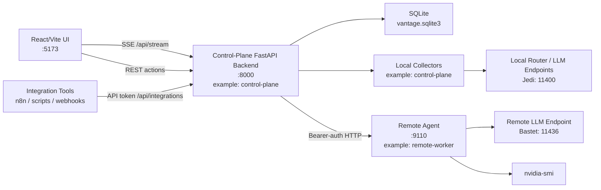
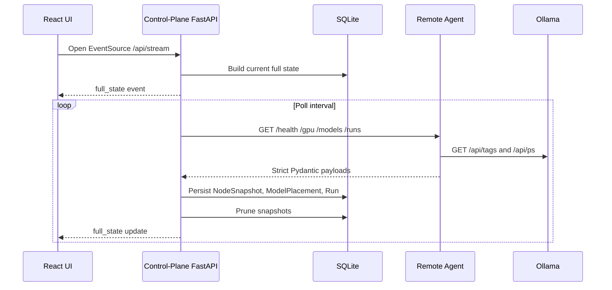

# Architecture

Vantage is a local-first control plane composed of three main pieces:

The examples below use `control-plane` as an example control-plane node name and `remote-worker` as an example remote worker node name. Replace them with names from your own homelab.

- `Control-plane backend`: FastAPI, SQLite, SQLAlchemy, Pydantic, collectors, polling, pruning, routing, run history, and SSE streaming. In examples, this node is named `control-plane`.
- `Frontend`: Vite, React, and TypeScript operator UI for nodes, runs, models, routing, warning review, and in-app documentation.
- `Remote agent`: lightweight FastAPI process on Linux worker nodes. In examples, one worker is named `remote-worker`.
- `Integration surface`: optional API-token-protected endpoints for external automation, webhook dispatch, router-log import, Markdown reports, and collector discovery.

The system is intentionally an observer and coordinator. It does not replace local LLM runtimes, routers, schedulers, or host services.

## Runtime Shape

## Data Flow

## Core State Types

Vantage keeps three kinds of state separate:

- `Configured state`: node registry, routing rules, thresholds, and bootstrap settings.
- `Observed state`: snapshots and run records collected from machines and agents.
- `Derived display state`: UI classifications such as `healthy`, `stale`, `degraded`, `unreachable`, attention summaries, and warning visibility.

A node can be configured as enabled, last observed as healthy, and currently stale. Those are different facts and should not collapse into one field.

The frontend keeps derived state lightweight and reversible. The attention ribbon summarizes operator signals, the warning strip caps visible warning records by default, node heartbeat meters visualize freshness decay without changing persisted truth, and node diagnostics explain degraded state from observed errors.

Integrations follow the same rule. `/api/integrations/events` exports normalized facts from warnings and runs; it does not create a second alert database. Router-log imports become normal durable `Run` records. Markdown reports are generated from current SQLite state. Webhook dispatch is opt-in and external-tool-facing, not required for the control plane to function.

## Persistence

SQLite is the Phase 1 database. The main tables are:

- `nodes`: configured node registry
- `node_snapshots`: time-series observations
- `model_placements`: observed model inventory
- `runs`: actions, inferences, remote events, and meaningful operational work
- `routing_rules` and `routing_rule_nodes`: preferred routing order, model-specific policy lanes, failover allowances, and eval pass-rate thresholds
- `routing_rule_history`: durable create, update, and delete history for routing policy changes
- `warning_records`: durable warning state
- `app_settings`: runtime-managed settings such as node enabled-state overrides
- `eval_suites`, `eval_cases`, and `eval_schedules`: Phase 2 prompt-suite definitions, score configuration, and recurring rules; queued, manually triggered, and schedule-triggered eval attempts are stored as `Run` records with `detail_type = "eval_attempt"`

`NodeSnapshot` is pruned automatically by age and by per-node count so continuous polling does not grow the database forever.

Warnings can move from `active` to `acknowledged` without being deleted. Reconciliation reuses acknowledged warnings for the same condition instead of recreating a new active warning every poll, then marks them resolved when the underlying drift disappears.

Schema evolution is handled through Alembic. Production startup runs `alembic upgrade head` before launching Uvicorn, and `migrations/env.py` enables SQLite batch mode so future table rebuilds can be expressed safely.

## Streaming Model

The frontend uses `EventSource` against `/api/stream`.

On connection, the backend sends a `full_state` event. During normal runtime, the polling loop publishes fresh full-state updates through the event broker. This keeps the UI honest after reconnects because it re-syncs from the backend's current persisted state instead of trusting browser memory.

## Observability Baseline

The control-plane backend exposes deployment-friendly health checks:

- `/api/health`: backward-compatible process status
- `/api/health/live`: process-only liveness for service supervisors
- `/api/health/ready`: readiness check for database access, required schema tables, and bootstrap config loading

Readiness failures return HTTP `503` with a compact machine-readable check map. The response deliberately avoids secrets, absolute local paths, and private network details.

Backend logs are written to stdout as JSON records with timestamp, level, logger, message, and exception details when present. This keeps Docker Compose, Portainer, and systemd deployments aligned around the same log stream.

## Production Packaging

Production deployment uses `docker-compose.prod.yml`.

- The backend image runs Alembic migrations before starting Uvicorn.
- The frontend image serves static assets through Nginx and proxies `/api` traffic to the backend.
- SQLite is persisted to a named Docker volume by default.
- Backend readiness and frontend static serving are wired as container health checks.
- Docker JSON logs are bounded with `max-size` and `max-file`.

Release bundles are generated by `scripts/build-release.ps1` and the GitHub release workflow. Bundles include public-safe sample config and exclude live env files, SQLite databases, logs, and local build artifacts.

## Agent Model

Remote nodes expose a small HTTP API. The backend polls the agent with a bearer token when `VANTAGE_AGENT_SHARED_TOKEN` is configured.

The current agent contract covers:

- host health
- GPU telemetry
- Ollama model inventory
- current remote runs and loaded models
- capability-check execution
- eval-attempt execution for prompt-suite cases

The agent is deliberately small so it can eventually become a single binary without forcing a backend rewrite.

Remote Linux workers can install the Python agent through the generic `deploy/agent/install.sh` script. The installer creates a dedicated `vantage-agent` system user, writes `/opt/vantage/vantage-agent.env`, and enables `vantage-agent.service` through systemd.

## Eval Model

Phase 2 uses Eval Lab rather than a separate eval database. `EvalSuite` groups prompt cases, and `EvalCase` stores individual prompts, expected JSON, `score_type`, `score_config_json`, and sort order. Operators can create, edit, duplicate, import, export, and clean up suites and cases, then queue suite attempts against a selected model placement. `EvalSchedule` stores recurring rules for a suite and model placement. Queue-only scheduling is the safe default. Operators can also manually queue an enabled schedule immediately; that writes normal eval `Run` records and updates `last_queued_at` without advancing `next_run_at`, so the recurring cadence remains intact. When `auto_execute` is explicitly enabled on a schedule, the same lightweight FastAPI lifespan worker queues due eval `Run` records and immediately executes them through the normal eval runner. This avoids Redis, Celery, or a separate scheduler while preserving the Runs ledger as the durable truth. Failed auto-executed schedules create deterministic `eval_schedule_failure` warnings, and later clean scheduled runs resolve those warnings instead of leaving stale alarm state.

Each queued case becomes a durable `Run` record with `source_type = "eval"` and `detail_type = "eval_attempt"`. Execution updates that same Run with response text, parsed JSON when possible, score details, and the observed model digest at queue time when available. The scoring layer supports JSON subset, exact match, contains, regex, numeric threshold, and lightweight JSON-schema style checks. Remote agents provide the raw response; the control plane applies final scoring so local and remote attempts use the same scoring semantics.

Score history, placement comparison views, baseline regression checks, trend charts and rows, flaky-case detection, failure clusters, model comparison summaries, schedule health summaries, and score-detail drilldowns are derived from the existing `Run` history instead of creating a separate truth source. The score-history API accepts an operator-selected time window, optional model/node placement filter, flakiness threshold, and failure-cluster minimum so UI charts, exports, and assisted summaries share one scoped view of the same durable run ledger. Saved Eval Intelligence presets are intentionally browser-local UI shortcuts rather than managed cluster configuration. Suite-level baselines are stored in `EvalSuite.metadata_json` so they remain attached to the prompt pack while preserving the run ledger as the observed source of truth.

Optional assisted summaries are deliberately operator-triggered. The backend builds a compact JSON snapshot from deterministic eval history, sends it to the selected observed model placement, and stores the returned text as a durable `Run` with `detail_type = "eval_assisted_summary"`. The summary is advisory UI assistance only; scoring, regressions, and exports continue to use raw eval `Run` data.

Eval lifecycle cleanup is intentionally narrow. Operators can delete schedules and individual prompt cases from the Eval Lab, and can delete a prompt suite only after its cases and schedules are removed. Historical eval `Run` records are not deleted by these lifecycle actions; they remain the audit trail and score-history source.

## Failure Behavior

Vantage prefers explicit uncertainty:

- stale data remains visible but labeled stale
- unreachable nodes preserve last-known telemetry
- partial agent failures become degraded state
- submitted actions can remain `submitted_unverified`
- routing and model placement are shown as observed, not assumed
- routing overrides repeat target node state through text, color, icons, and a dry-run route simulation before saving configured preference changes
- routing dry-runs explain selected, skipped, and rejected nodes using observed health, freshness, enabled-state, model placement, and eval pass-rate evidence
- diagnostics suggest remediation from observed state but do not silently mutate config or restart host services
- warning acknowledgement is an allowlisted remediation action and creates an audit `Run`
- verified node refresh is an allowlisted remediation action that retries one collector pass and closes the audit `Run` as `success` or `failed`
- node quarantine is an allowlisted configured-state action that writes a runtime enabled-state override, disables polling, removes the node from routing preference lists, and records the change as an audit `Run`
- local Ollama endpoint suppression is an allowlisted configured-state action that writes a runtime endpoint override, excludes the endpoint from local polling, capability checks, and eval execution, and records the change as an audit `Run`
