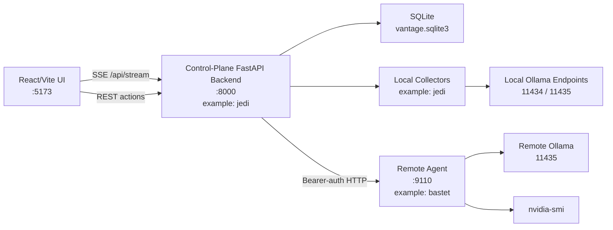
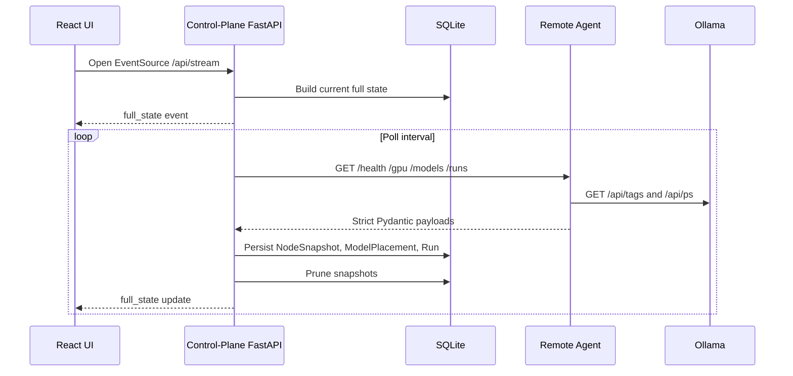

# Architecture

Vantage is a local-first control plane composed of three main pieces:

The examples below use `jedi` as an example control-plane node name and `bastet` as an example remote worker node name. Replace them with names from your own homelab.

- `Control-plane backend`: FastAPI, SQLite, SQLAlchemy, Pydantic, collectors, polling, pruning, routing, run history, and SSE streaming. In examples, this node is named `jedi`.
- `Frontend`: Vite, React, and TypeScript operator UI for nodes, runs, models, and routing.
- `Remote agent`: lightweight FastAPI process on Linux worker nodes. In examples, one worker is named `bastet`.

The system is intentionally an observer and coordinator. It does not replace Ollama, routers, schedulers, or host services.

## Runtime Shape

## Data Flow

## Core State Types

Vantage keeps three kinds of state separate:

- `Configured state`: node registry, routing rules, thresholds, and bootstrap settings.
- `Observed state`: snapshots and run records collected from machines and agents.
- `Derived display state`: UI classifications such as `healthy`, `stale`, `degraded`, and `unreachable`.

A node can be configured as enabled, last observed as healthy, and currently stale. Those are different facts and should not collapse into one field.

## Persistence

SQLite is the Phase 1 database. The main tables are:

- `nodes`: configured node registry
- `node_snapshots`: time-series observations
- `model_placements`: observed model inventory
- `runs`: actions, inferences, remote events, and meaningful operational work
- `routing_rules` and `routing_rule_nodes`: preferred routing order
- `warning_records`: durable warning state
- `app_settings`: future runtime-managed settings

`NodeSnapshot` is pruned automatically by age and by per-node count so continuous polling does not grow the database forever.

## Streaming Model

The frontend uses `EventSource` against `/api/stream`.

On connection, the backend sends a `full_state` event. During normal runtime, the polling loop publishes fresh full-state updates through the event broker. This keeps the UI honest after reconnects because it re-syncs from the backend's current persisted state instead of trusting browser memory.

## Agent Model

Remote nodes expose a small HTTP API. The backend polls the agent with a bearer token when `VANTAGE_AGENT_SHARED_TOKEN` is configured.

The current agent contract covers:

- host health
- GPU telemetry
- Ollama model inventory
- current remote runs and loaded models
- capability-check execution

The agent is deliberately small so it can eventually become a single binary without forcing a backend rewrite.

## Failure Behavior

Vantage prefers explicit uncertainty:

- stale data remains visible but labeled stale
- unreachable nodes preserve last-known telemetry
- partial agent failures become degraded state
- submitted actions can remain `submitted_unverified`
- routing and model placement are shown as observed, not assumed
