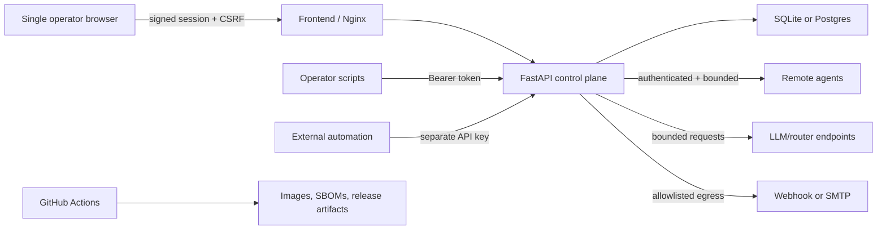

# Vantage Security Audit

## Release decision

**Decision:** `CONDITIONAL GO` for a private release candidate.

**Public-release gate:** keep the repository private until the new GitHub security workflow has completed successfully at least once and the repository-owner checklist below is complete.

**Applies to:** commit `75344c122ca6dda5e9d1cc025fb25f24971a112c` plus the uncommitted working tree verified locally on 2026-07-25.

There are no open confirmed P0 or P1 findings in the reviewed tree. The original release blockers—unauthenticated control-plane and integration access, unrestricted webhook delivery, broad network exposure, root containers, vulnerable dependencies, mutable CI dependencies, and contaminated packaging—are remediated and covered by regression or runtime checks.

## Scope and assurance statement

- Repository: `jbright471/Vantage`; confirmed private with no active GitHub release when this audit began.
- Mode: patch, threat-model, and pre-release verification of the local working tree.
- Reviewed surfaces: Python/FastAPI control plane and agent, React/Vite frontend, Nginx, SQLAlchemy persistence, imports/exports, webhooks and SMTP configuration, Docker/Compose, release packaging, and GitHub Actions.
- Runtime verification: development stack on loopback, an isolated production stack with synthetic data, and the explicitly authorized Bastet Pop!_OS worker on the private LAN.
- Deliberately not contacted: SMTP servers, webhook receivers, and unrelated LAN hosts. Remote-agent authentication was verified against isolated contracts and the upgraded Bastet worker.
- Limitation: the deleted remote release asset was unavailable for rescanning. The retained Git history, current tracked tree, and locally retained release directories were scanned instead.
- Limitation: CodeQL and GitHub dependency review are configured but can only be considered verified after GitHub-hosted execution.

## Architecture and trust boundaries



Vantage intentionally uses a single-operator authorization model. Model output is advisory data and is never treated as authorization. Remote agents have explicit action allowlists, authentication, replay protection for HMAC mode, request limits, prompt/output bounds, and response-size caps.

## Security control matrix

| Control | Result | Evidence or remaining limitation |
|---|---|---|
| VC-01 secure exposure | PASS | Development binds to loopback; production publishes only the frontend and defaults to loopback. |
| VC-02 secret hygiene | PASS | Gitleaks 8.30.1 found no secrets in all 32 commits or the tracked working tree; active ignored `.env` was excluded by design. Deleted remote asset unavailable. |
| VC-03 artifact hygiene | PASS | Release builder uses `git ls-files`; 149-entry smoke ZIP contained zero forbidden entries. |
| VC-04 authentication | PASS | Control-plane routes fail closed; signed HttpOnly sessions, Bearer automation, CSRF, expiry, and login throttling are tested. |
| VC-05 authorization | PASS | Documented single-operator boundary; agent and integration credentials are separate and scoped. |
| VC-06 resource abuse | PASS | Costly routes have rate/concurrency gates; prompt, import, output-token, and response-size limits are enforced. |
| VC-07 SSRF and egress | PASS | Exact host allowlist, DNS/address validation, redirect denial, private-network opt-in, timeouts, and URL redaction are tested. |
| VC-08 file/import safety | PASS | Imports are typed and capped; release inputs are tracked-only; generated report locations are configured rather than request-selected. |
| VC-09 injection/XSS | PASS | Semgrep returned zero findings; CSP disallows inline scripts; React rendering and typed API models are used. |
| VC-10 parser limits | PASS | Nginx body cap plus suite/prompt/description limits constrain untrusted payloads. |
| VC-11 sensitive data | PASS | API responses are `no-store`; webhook secrets are redacted; real env/database files are excluded from releases. |
| VC-12 infrastructure | PARTIAL | Local defaults are safe. Public GitHub security settings and production TLS are owner/deployment actions. |
| VC-13 AI safety | PASS | Threat model documents model distrust; model paths are authenticated, bounded, and cannot grant authority. |
| VC-14 browser security | PASS | SameSite/HttpOnly session, CSRF token, strict headers, no browser token storage, authenticated DAST, and clean browser console. |
| VC-15 supply chain | PASS | NPM, pip-audit, OSV, Trivy, Gitleaks, Semgrep, digest-pinned bases, and SHA-pinned Actions are clean. |
| VC-16 cryptography | PASS | Standard constant-time comparison and ItsDangerous signing are used; new agents default to exact-body HMAC with timestamp, nonce, replay checks, and secrets of at least 32 characters. |
| VC-17 service authentication | PASS | Agent and integration authentication fail closed; weak/missing secrets return 503. |
| VC-18 replay/state safety | PARTIAL | HMAC nonces/timestamps and tested idempotency exist; multi-process race testing remains future hardening. |
| VC-19 network resilience | PASS | Outbound calls use explicit destinations, timeouts, redirect denial, sanitized results, and egress constraints. |
| VC-20 streaming/session | PASS | SSE is covered by the same auth middleware; session expiry/revocation-by-key-rotation and same-origin cookies apply. |
| VC-21 container/release | PASS | Non-root users, read-only filesystems, dropped capabilities, no-new-privileges, pinned bases, and internal backend networking verified. |
| VC-22 detection/response | PARTIAL | Auth/rate counters and security guidance exist; external alert delivery is deployment-specific. |
| VC-23 recovery | PARTIAL | Synthetic SQLite backup/restore passed integrity and content checks; encrypted off-host retention is deployment-specific. |
| VC-24 verification | PASS | Unit/integration, build, SCA, SAST, image, artifact, DAST, and browser checks completed. |

## Remediated findings

| ID | Severity | Finding | Status and evidence |
|---|---:|---|---|
| VC-04-001 | P0 | Human control-plane routes lacked authentication | Fixed: fail-closed middleware, signed session, CSRF, Bearer mode, expiry, throttling; negative tests pass. |
| VC-17-001 | P0 | Remote agent accepted requests without a configured token | Fixed: missing or shorter-than-32 token returns 503; installer refuses weak secrets. |
| VC-17-002 | P0 | Integration automation accepted requests without a configured token | Fixed: all automation routes fail closed and use a distinct key. |
| VC-07-001 | P0 | Webhook delivery allowed unrestricted targets and retained secret URLs | Fixed: exact allowlist, IP validation, redirect denial, private-network opt-in, redaction, tests. |
| VC-01-001 | P0 | Docker ports defaulted to all interfaces | Fixed: loopback defaults; production backend is internal only. |
| VC-15-001 | P1 | Frontend dependency graph contained known vulnerabilities | Fixed: lockfile updated; npm audit reports zero vulnerabilities. |
| VC-15-002 | P1 | CI used EOL Node, mutable Actions, and broad write-token exposure | Fixed: Node 24, full action SHAs, read-only defaults, isolated release publication. |
| VC-21-001 | P1 | Release bundles recursively copied untracked artifacts | Fixed: tracked-only packaging and forbidden-entry smoke verification. |
| VC-21-002 | P1 | Production containers ran as root | Fixed: backend UID 10001 and frontend `nginx`; read-only/capability restrictions verified at runtime. |
| VC-06-001 | P1 | Costly AI/eval paths lacked global abuse bounds | Fixed: request rate/concurrency, input, output-token, response, and import caps with tests. |
| VC-15-003 | P1 | Agent dependency resolution could select vulnerable `idna` | Fixed: `idna>=3.15` in both dependency manifests; OSV, pip-audit, and final image scan clean. |
| VC-02-002 | P1 | Linux onboarding placed the shared agent secret in a shell command and defaulted to bearer authentication | Fixed: the installer prompts interactively or reads a root-only token file, validates URL-safe entropy, hardens existing environments to mode `600`, defaults new installs to HMAC, and the public guides no longer put secrets in command history. |
| VC-18-001 | P2 | Interactive remote model paths bypassed the HMAC-aware polling transport | Fixed: polling, capability checks, manual/scheduled evals, assisted summaries, and remote judges share one exact-body signing transport; signed GET/POST contract tests pass. |

No finding was waived or accepted as risk.

## Verification evidence

| Check | Version/scope | Result |
|---|---|---|
| Pytest | Python 3.14 / pytest 9.0.2 | **147 passed** |
| Vitest | Vitest 3.2.7 | **56 passed** |
| TypeScript/Vite | Vite 7.3.6 production build | Passed |
| NPM audit | npm 11.7.0 | **0 vulnerabilities** |
| pip-audit | 2.10.1, resolved production Python environment | **0 vulnerabilities** |
| OSV-Scanner | 2.3.8, recursive source/manifests | **0 vulnerabilities** after `idna` constraint |
| Gitleaks | 8.30.1, 32-commit history and tracked working tree | **0 findings**; exact false-positive allowlist only |
| Semgrep | 1.171.0, Python + TypeScript, 225 rules / 91 files | **0 findings** |
| Trivy filesystem | 0.70.0, vulnerabilities/secrets/misconfigurations | **0 HIGH/CRITICAL; 0 Dockerfile misconfigurations** |
| Trivy images | exact final backend and frontend images | **0 fixed HIGH/CRITICAL vulnerabilities** |
| CycloneDX | exact final production images | SBOMs generated under `.security/sbom/` (locally ignored; CI uploads them) |
| ZAP baseline | authenticated isolated production deployment | **0 failures**; two informational observations only |
| Playwright | authenticated production UI | Login and application rendered; **0 console errors/warnings** |
| Multi-node workflow | isolated HMAC agent plus running control plane | Signed `/health` setup check passed with matching `node_id`; in-process signed GET/POST agent contract and updated setup-wizard browser workflow passed. |
| Bastet Linux upgrade | authorized private-LAN Pop!_OS worker | Legacy service backed up; dedicated service identity, HMAC health, two GPUs, two models, deterministic Gemma capability check, systemd source restriction, and restart recovery passed. |
| Container runtime | isolated production Compose | backend UID 10001; frontend UID 101; read-only/cap-drop/no-new-privileges passed |
| Backup/restore | synthetic SQLite data | Integrity, digest, and sentinel checks passed |
| Release smoke | tracked-file ZIP | 149 entries; **0 forbidden; 0 required missing** |

Final local image identities:

- Backend: `sha256:15e4259ea1aa9bae389516c3721bdd7f776cd0e1ec3a59b2fb4679ffd6dfb709`
- Frontend: `sha256:8b7b39e8507fea151da74eb950038d79f6f3c9b087ecec6b7daf1c68df252ed5`

## Remaining risks and required next actions

### Before making the repository public

- [ ] Commit the reviewed tree on a protected branch and run `.github/workflows/security.yml` in GitHub.
- [ ] Require the test and security workflows before merge; enable Dependabot alerts, secret scanning, push protection, and private vulnerability reporting.
- [ ] Inspect the generated Semgrep result and both CI SBOM artifacts, then record the successful workflow URL in the release checklist.
- [ ] Build the release ZIP from a clean checkout and scan that exact ZIP before publication.
- [ ] Complete the remaining external-host checks in `docs/architecture/V1_MULTI_NODE_ACCEPTANCE.md`: a clean external-user install, the starter eval suite, and firewall denial from an unrelated LAN address. Bastet upgrade and restart recovery are verified.
- [ ] If any real credential was present in the deleted release asset—which is no longer available to prove either way—rotate it before publication. No real credential was found in retained history or artifacts.

Suggested operator commands after committing the changes:

```powershell
gh workflow run security.yml --ref <review-branch>
gh run list --workflow security.yml --limit 1
gh run watch <run-id> --exit-status
pwsh -File .\scripts\build-release.ps1 -Version <version>
```

### Before any non-loopback deployment

- [ ] Terminate TLS at a trusted reverse proxy and set `VANTAGE_SESSION_COOKIE_SECURE=1`.
- [ ] Keep the backend unexposed; publish only the frontend and restrict ingress by firewall/VPN or identity-aware proxy.
- [ ] Use a managed secret store, distinct operator/session/agent/integration/audit keys, and a documented rotation interval.
- [ ] Configure outbound firewall rules in addition to Vantage's webhook allowlist.
- [ ] Configure encrypted off-host backups, retention, restore drills, and alert delivery.

Until those deployment controls exist, keep `VANTAGE_BIND_ADDRESS=127.0.0.1`. The secured development stack is currently running only on `127.0.0.1:5173` and `127.0.0.1:8000`.

## Reverification commands

```powershell
python -m pytest -q
Push-Location frontend
npm test -- --run
npm run build
npm audit --audit-level=high
Pop-Location
pwsh -File .\scripts\check-setup.ps1
docker compose config --quiet
docker compose -f docker-compose.prod.yml config --quiet
git diff --check
```

The machine-readable companion is `.security/findings.json`; the operating threat model is `docs/security/THREAT_MODEL.md`.
