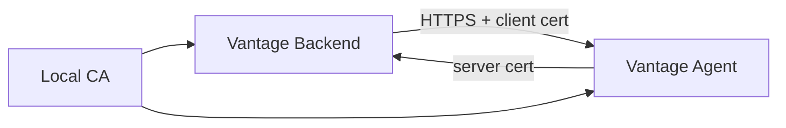

# Optional mTLS Research

mTLS is not part of the default Vantage deployment because it adds certificate lifecycle complexity that most single-operator homelabs do not need on a trusted LAN or VPN. It becomes attractive when agents run on less-trusted networks, multiple operators manage the same cluster, or audit requirements demand mutual machine identity.

## When mTLS Is Worth Considering

- Remote agents are reachable across site-to-site VPNs or semi-trusted networks.
- Multiple operators can deploy agents.
- You need machine identity independent of a shared secret.
- You need certificate revocation instead of only token rotation.

## Candidate Architecture

## Open Questions

- Should Vantage generate a local CA or integrate with an operator-managed CA?
- Where should cert/key files live for Docker, Portainer, and systemd deployments?
- How should certificate rotation be represented in the UI and audit log?
- Should mTLS be required only for mutating actions or for all telemetry?

## Current Recommendation

Use bearer auth for simple LAN deployments, HMAC mode for stronger shared-secret deployments, and reserve mTLS for a later multi-operator or less-trusted-network phase.
