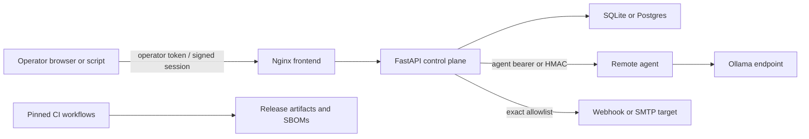

# Vantage Threat Model

## Scope and assets

This model covers the operator browser, Nginx frontend, FastAPI control plane, SQLite/Postgres state, remote agents, Ollama-compatible model endpoints, webhook/SMTP integrations, CI, and release artifacts. Protected assets include operator and agent credentials, model prompts and responses, node inventory, routing policy, audit history, and host/network reachability.

## Trust boundaries

## Primary threats and controls

| Threat | Primary controls | Residual risk |
|---|---|---|
| Unauthorized operator action | Fail-closed operator auth, HttpOnly signed session, CSRF, login throttling, loopback bind default | Shared single-operator identity; copied session remains valid until expiry |
| Remote-agent impersonation or replay | Required high-entropy token, action allowlist, optional timestamped HMAC and nonce cache | Bearer mode has no replay protection; use HMAC on untrusted networks |
| LLM/eval cost or resource abuse | Operator auth, per-minute and concurrency gates, output-token limit, prompt/response/suite caps, timeouts | Limits are per process and are not a distributed quota ledger |
| Prompt injection affecting decisions | Candidate prompt/output marked untrusted, bounded JSON judge schema, evidence truncation, advisory summaries, deterministic checks retained | An LLM judge can still be manipulated; do not use it as the sole safety or authorization signal |
| SSRF or secret-bearing webhook leakage | Exact host allowlist, DNS/IP validation, redirects disabled, private-network opt-in, redacted persistence | DNS rebinding requires network egress enforcement for stronger assurance |
| Browser attacks | CSP, anti-framing, MIME sniffing protection, strict referrer policy, same-site cookies, CSRF | TLS and `Secure` cookies depend on deployment configuration |
| Container breakout impact | Non-root users, dropped capabilities, read-only roots, `no-new-privileges`, internal backend | Kernel/runtime vulnerabilities remain host responsibilities |
| Supply-chain or release compromise | SHA-pinned Actions, CodeQL/Semgrep, dependency/secret/image scans, SBOMs, tracked-file release packaging | Scanner databases and third-party build infrastructure remain external dependencies |
| Operational data loss | Persistent volume, SQLite backup API procedure, restore exercise | Vantage does not encrypt backups or manage off-host retention |

## AI-specific invariants

- Model output is data, never authorization.
- Vantage does not execute shell commands, select webhook destinations, or expand agent permissions from model output.
- Assisted summaries remain advisory and preserve deterministic telemetry.
- LLM judges must return a narrow validated JSON shape; their output may influence eval scoring but must not become the sole approval for a high-impact action.
- Production operators should keep egress restricted to declared agents, model endpoints, and integrations.

## Deployment assumptions

Vantage currently supports one trusted operator and one active control-plane process. Public internet exposure, untrusted multi-tenancy, and multiple active control planes are outside the supported threat model. Use a VPN or identity-aware reverse proxy in addition to Vantage authentication for remote access.
