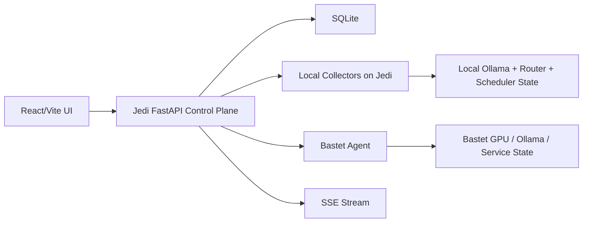

# Vantage Design

## Status

Draft for review

## Summary

`Vantage` is a local-first control plane for serious private AI setups. The product monitors nodes, models, routing, and runs across multiple machines while preserving independent operation of existing services such as `ollama_router`, `autoskill`, Task Scheduler jobs, and Bastet systemd services.

The MVP is intentionally focused:

- `Nodes`: live health, freshness, reachability, GPU telemetry, and service visibility
- `Runs`: truthful operational history across key systems
- `Models`: merged inventory across nodes
- `Routing View`: visibility-first view of active routing policy, with only light editing if the config surface is stable

`Evals` are explicitly deferred to Phase 2 and will be built on top of the run system.

## Product Positioning

Primary initial user: the current single-operator local AI homelab on `Jedi` and `Bastet`.

Product direction: design the MVP for one operator first, but keep the abstractions clean enough to expand to advanced local-AI operators later.

Working pitch:

> An operating system for serious local AI setups: monitor your rigs, route intelligently, and evaluate prompts, models, and agents in one private control plane.

## Design Principles

- `Observer, not replacer`
  The control plane sits above existing systems. It observes, coordinates, and sometimes acts, but it does not become the only way those systems function.
- `Truth over appearance`
  Never present guessed state as current state.
- `Observed beats inferred`
  Separate directly observed state from derived UI state.
- `Freshness is first-class`
  Every live panel must expose when the data was last updated.
- `Independent operation is preserved`
  If the control plane is down, `ollama_router`, `autoskill`, Task Scheduler jobs, and Bastet services keep running.
- `Every action is auditable`
  Any action initiated by the control plane creates a durable run record.

## MVP Scope

### Included

- Local-first control plane backend on `Jedi`
- Lightweight node agent on `Bastet`
- Node registry and bootstrap config
- Persistent snapshots and run history
- Live SSE updates to the UI
- Three main product surfaces: `Nodes`, `Runs`, `Models`
- Visibility-first routing view
- A very small initial action layer

### Explicitly Excluded From Phase 1

- Eval runner UI
- Team accounts, user login, or auth-heavy collaboration
- Billing or licensing
- Cloud sync
- Broad multi-operator packaging polish
- Large routing-rule editing surface if the underlying config path is still moving

Note: lightweight node-to-node agent authentication is still allowed in Phase 1. What is excluded here is human-facing product auth, not machine-to-machine trust between the Jedi control plane and Bastet agent.

## Architecture

The MVP uses a local-first architecture with one main application on `Jedi` and one lightweight remote agent on `Bastet`.

### Runtime Layers

1. `UI layer`
   React/Vite frontend for nodes, runs, models, routing visibility, warnings, and operator actions.
2. `Control API`
   FastAPI backend on `Jedi` that owns persistence, polling, normalization, streaming, action orchestration, pruning, and later reconciliation.
3. `Collectors`
   Local collectors on `Jedi` plus an HTTP node agent on `Bastet`.
4. `Execution adapters`
   Action wrappers for refresh, restart, and later routing reloads or eval triggers.

### Stack

- Frontend: `React + Vite`
- Backend: `FastAPI`
- Validation: `Pydantic`
- Persistence: `SQLite + SQLAlchemy`
- Streaming: `SSE`
- Remote node contract: lightweight `FastAPI` agent on `Bastet`
- Logging: structured JSON logs from the start

### Why FastAPI

- Strong fit with the existing Python-heavy ecosystem: `ollama_router`, `autoskill`, job hunters, and system integration
- Good support for concurrent polling and HTTP integration work
- Clean Pydantic-based contracts across backend and agent boundaries

### Why a Bastet Agent From Day One

The remote-node contract should be real immediately. Building the agent early prevents the Jedi backend from accidentally assuming everything is local and keeps node collection uniformly HTTP-based.

The Bastet agent does not need to be sophisticated. A small systemd-managed FastAPI process exposing a minimal contract is sufficient for MVP.

## Component Layout



## Node Agent Contract

Initial remote agent endpoints:

- `GET /health`
- `GET /gpu`
- `GET /models`
- `GET /runs` for agent-local action and service events when exposed by the node

All responses should be strict Pydantic models so the control plane and agent cannot silently drift apart.

## State Model

The system must keep three kinds of state separate:

- `Configured state`
- `Observed state`
- `Derived display state`

Example:

A node can be configured as enabled, last observed as healthy, and currently stale. Those are not the same fact and must not collapse into one generic object.

## Persistence Model

### Core Entities

```text
Node
- node_id
- display_name
- base_url
- role                   # primary | worker | remote
- enabled
- auth_mode              # nullable; node-to-node auth only in Phase 1
- auth_config_json       # nullable; shared secret or agent auth config
- created_from           # bootstrap | ui
- last_seen_at

NodeSnapshot
- snapshot_id
- node_id
- captured_at
- gpu_json
- cpu_json
- memory_json
- ollama_json
- health_status

Run
- run_id
- source_type            # autoskill | router | scheduler | agent_action
- detail_type            # autoskill_run | router_request | scheduler_job | agent_action
- source_id
- node_id
- model_name             # nullable
- action_type            # infer | sync | restart | wake | reload
- status
- idempotency_key        # nullable for passive runs
- started_at
- ended_at
- duration_ms
- summary
- metadata_json

ModelPlacement
- placement_id
- node_id
- model_name
- model_digest           # nullable
- available
- last_seen_at

RoutingRule
- rule_id
- priority_class         # interactive | batch | scheduled
- model_name             # nullable for default rules
- enabled

RoutingRuleNode
- id
- rule_id
- node_id
- sort_order

AppSetting
- key
- value_json
- updated_at

WarningRecord
- warning_id
- warning_type
- severity               # info | warning | critical
- node_id                # nullable
- first_seen_at
- last_seen_at
- status                 # active | resolved
- summary
- metadata_json
```

### Run Semantics

`Run` is the common event envelope for meaningful actions and meaningful operational work. It is not the storage location for every poll.

Rules:

- Passive polls go to `NodeSnapshot`
- Actions, inferences, scheduler jobs, and other meaningful events go to `Run`
- `detail_type` exists so runs are queryable without forcing JSON parsing in filters

### Run Statuses

```text
queued
running
success
failed
partial
timed_out
abandoned
submitted_unverified
```

### Idempotency

All operator-triggered actions should carry a stable idempotency key.

Suggested key material:

```text
(action_type, target_node_id, target_resource_id, requested_payload_fingerprint, dedupe_window)
```

The final value should be a stable hash derived from those fields.

## Config Layer

The product needs an explicit config layer so setup and recovery do not depend on manual database edits.

### Tier 1: Bootstrap Config

A local file on `Jedi` seeds the system with:

- node IDs and names
- base URLs
- roles
- enabled flags
- polling intervals
- retention settings
- optional shared secrets or agent auth settings

### Tier 2: Managed App Config

After bootstrap, active settings live in SQLite and are editable through the UI.

`AppSetting` is the runtime home for settings that the operator may reasonably tune without redeploying or hand-editing files.

Examples:

- polling intervals
- stale and unreachable thresholds
- snapshot retention window
- run timeout thresholds
- idempotency dedupe windows
- UI-visible feature flags for MVP surfaces

Bootstrap config remains the source for initial node seeding, recovery defaults, and environment-level values that should not drift casually at runtime.

Startup behavior:

1. Load bootstrap config.
2. Seed missing nodes and settings into SQLite.
3. Preserve DB-managed rows unless config explicitly says to overwrite.
4. Start collectors using DB-backed active config.
5. Surface config mismatches in the UI.

## Data Flow

1. Bastet agent exposes node state over HTTP.
2. Jedi backend polls local collectors and remote agents on a short cadence.
3. Fresh snapshots are normalized and persisted.
4. Significant events create `Run` records.
5. The backend streams a full-state event on new SSE connection.
6. After initial sync, the backend streams deltas.
7. On reconnect after backend restart, the UI re-syncs from full state rather than trusting stale local assumptions.

## Streaming Model

Use `SSE` instead of frontend REST polling for live operational views.

Requirements:

- Full-state event on connect
- Delta events after connect
- Frontend reconnection handling using browser `EventSource`
- Re-sync after backend restart instead of naive stream resume

Milestone 4 is not complete until full-state-on-connect and reconnect behavior are working end-to-end.

## Failure Modes And Trust Behavior

The control plane must remain useful under partial failure and must be explicit about uncertainty.

### Trust Rules

- Never present guessed state as current state.
- Show freshness everywhere live state is rendered.
- Preserve last known state when current observation fails, but mark it stale.
- Distinguish `healthy`, `degraded`, `stale`, `unreachable`, `action pending`, and `action failed`.
- If completion cannot be verified, show `submitted_unverified`.

### Key Failure Modes

1. `Remote node unreachable`
   Keep last known snapshot and mark the node stale or unreachable based on freshness thresholds.
2. `Agent partially unhealthy`
   Example: `/health` responds but `/gpu` fails. Represent as degraded, not down.
3. `Backend restart`
   UI reconnects and receives full state before deltas.
4. `Duplicate actions`
   Idempotency keys prevent accidental duplicate execution.
5. `Router / model mismatch`
   Routing view shows degraded or partially satisfiable state when policy and actual placement disagree.
6. `Config drift`
   Must become a surfaced warning, not a hidden log line.
7. `Incomplete run lifecycle`
   Runs that start but never complete transition to timed-out or abandoned based on central thresholds.

### Timeout Policy

Timeout thresholds must be centrally defined in settings rather than embedded in handlers.

Examples:

- stale snapshot threshold
- unreachable threshold
- run timeout threshold
- abandoned-run threshold
- idempotency dedupe window

## Logging, Pruning, And Reconciliation

### Logging

Structured JSON logs are part of the foundation, not optional polish.

They are the primary observability layer before the UI fully exists and remain essential after it does.

### Snapshot Retention

`NodeSnapshot` is a time-series table and cannot grow forever at full resolution.

MVP requirement:

- prune snapshots automatically
- keep recent data hot
- do not silently let SQLite bloat until it becomes the outage

Suggested initial policy:

- keep full-resolution snapshots for the recent operational window
- defer rollups to a later phase

### Reconciliation

Reconciliation is a background correctness feature that compares:

- bootstrap config
- DB-managed config
- latest observed state

When meaningful drift exists, it writes a durable warning record visible to the UI.

This is deferred to hardening rather than required for initial polling bootstrap.

## MVP Product Surfaces

### Nodes

Purpose:

- truthful live health
- GPU status
- service visibility
- freshness and last-seen tracking

### Runs

Purpose:

- durable operational history
- action auditability
- truthful lifecycle statuses

### Models

Purpose:

- merged model inventory across nodes
- placement visibility
- availability and freshness status

### Routing View

Purpose:

- visibility into active routing policy and overrides
- possibly light editing if the route-config surface is stable enough

Default stance for MVP: visibility first, editing second.

## Action Layer

Phase 1 should include only a very small first action set.

Candidates:

- refresh node now
- restart Bastet agent
- trigger router config reload

Rules:

- all actions create `Run` records
- all actions use idempotency keys
- risky actions require explicit confirmation
- actions may end in `submitted_unverified` when submission succeeds but verification is not yet possible

## Testing And Verification

### Unit Tests

Cover:

- status transitions
- idempotency-key generation
- stale / degraded / unreachable classification
- model placement normalization
- snapshot pruning behavior

### Contract Tests

Validate Bastet agent responses against strict Pydantic models for:

- `/health`
- `/gpu`
- `/models`
- `/runs`

### Integration Tests

Run the Jedi backend against:

- fake Bastet agent
- fake Ollama endpoint
- temporary SQLite DB
- simulated event sources for scheduler and autoskill state

Verify:

- full-state-on-connect SSE
- delta streaming
- backend restart re-sync
- run creation
- model placement updates

### Failure-Injection Tests

Simulate:

- Bastet unreachable
- partial agent failure
- stale snapshots
- duplicate action submissions
- router/model mismatch
- incomplete run lifecycle

### Manual Smoke Tests

- stop Bastet agent and observe stale then unreachable state
- restart backend and confirm UI full-state re-sync
- trigger a control-plane action and confirm `submitted_unverified` appears honestly
- verify pruning runs as expected

## Phase 1 Implementation Plan

### Milestone 1: Foundation

Build:

- repo structure
- FastAPI backend skeleton
- React/Vite frontend skeleton
- SQLite + SQLAlchemy setup
- Pydantic models
- bootstrap config loading
- shared enums for node status, run status, detail types, and SSE event types
- structured logging

Acceptance:

- app boots cleanly
- config loads successfully
- persistence layer is live
- contracts are defined before collectors exist

### Milestone 2: Bastet Agent

Build:

- lightweight FastAPI agent
- `/health`
- `/gpu`
- `/models`
- `/runs` endpoint for agent-local action and service events
- systemd service definition

Acceptance:

- remote collector contract is reachable and stable
- backend-facing HTTP shape is real before local-only assumptions can form

### Milestone 3: Control Plane Backend

Build:

- node registration from bootstrap config
- local collectors and remote polling
- persistence for `Node`, `NodeSnapshot`, `ModelPlacement`, and `Run`
- state classification for healthy, degraded, stale, and unreachable
- snapshot pruning

Acceptance:

- backend truthfully represents local and remote state
- snapshots persist correctly
- runs are durable and queryable
- pruning works automatically

### Milestone 4: Streaming And Read APIs

Build:

- read endpoints for nodes, runs, models, routing view, and warnings
- SSE full-state event on connect
- SSE delta events after connect

Acceptance:

- frontend consumers can subscribe to one truthful live stream
- reconnect after backend restart causes a full-state re-sync
- no dependency on UI-side polling hacks

### Milestone 5: Frontend MVP

Build in this order:

1. `Nodes`
2. `Runs`
3. `Models`
4. lightweight routing view

Focus:

- freshness labeling
- stale/degraded/unreachable clarity
- truthful rendering of `submitted_unverified`

Acceptance:

- first genuinely usable operator UI exists
- UI preserves separation between configured, observed, and derived state

### Milestone 6: Action Layer And Hardening

Build:

- very small first action set
- idempotent action execution
- confirmation flows for risky actions
- timeout policies
- reconciliation service
- failure-injection and smoke-test hardening

Acceptance:

- product crosses from dashboard into control plane
- actions are auditable and safe
- drift and failure states surface honestly

## First Shippable Version

The first version is ready to ship when all of the following are true:

- Bastet agent is running
- Jedi backend polls local and remote state truthfully
- Nodes view shows live health and freshness clearly
- Runs view is durable and trustworthy
- Models view correctly merges inventory across nodes
- SSE reconnect and full-state re-sync work reliably
- snapshot pruning is active
- action handling is honest about verification state

## Phase 2 Preview

Phase 2 starts once the control plane has a mature run system and trustworthy operational data.

Primary next step:

- `Evals`

Build on top of the run system rather than around it:

- prompt suites
- model comparisons
- skill / agent evaluation history
- regression tracking

## Open Notes

- Keep the collector interface abstract enough that the Bastet Python agent can later be replaced by a single-binary agent without rewriting the control plane.
- Do not plan around a rewrite. Keep Python architecture clean so a future Rust agent remains an option, not a dependency.
